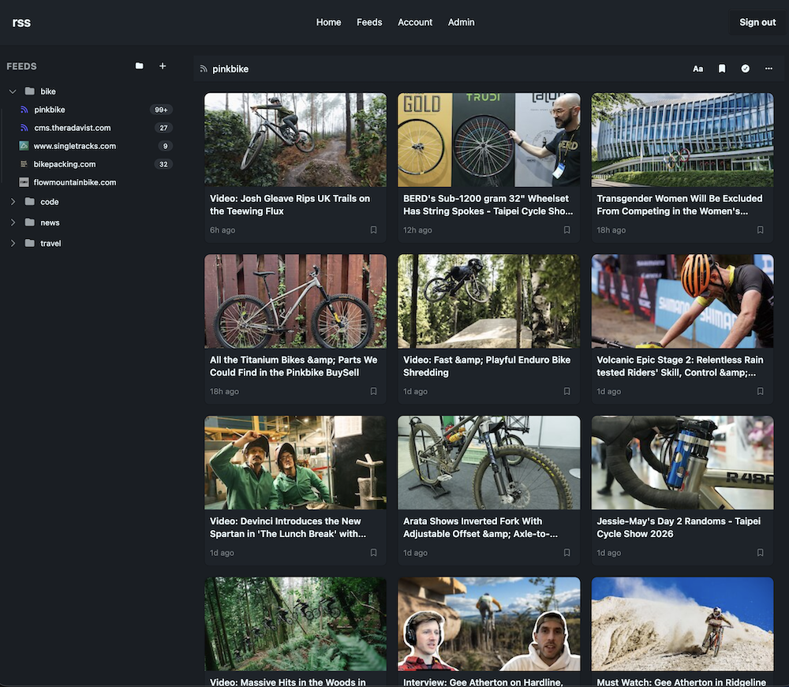
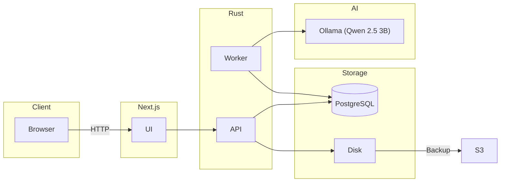

# RSS Reader

A simple RSS reader application, built with Rust and Next.js. It was scaffolded off [kaleido](https://github.com/ericbutera/kaleido).

## Quickstart

Run the project using Docker Compose `docker compose up`.

## Architecture

## CI/CD

The project uses [woodpecker-ci](https://woodpecker-ci.org/) with pipelines defined at [.woodpecker](./.woodpecker).

## Deployment

I currently deploy into my homelab using [Pulumi](https://www.pulumi.com/) for infrastructure management.

---

## TODO

- [ ] Document OpenAPI generation process
- [ ] Deployment
