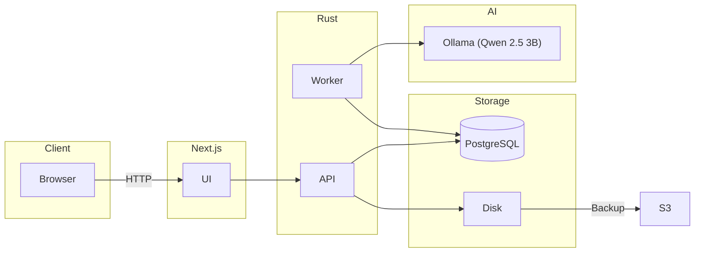

# RSS Reader

A simple RSS reader application, built with Rust and Next.js. It was scaffolded off [kaleido](https://github.com/ericbutera/kaleido).


## Quickstart

From the repo root:

```sh
task --list
task ui-next:dev
```

Use `task --list` to discover the current repo-local task surface.

The Next UI reads browser-facing runtime config from the server at launch. CI builds one UI image, and Pulumi injects deploy-specific values into the container.

## Kaleido Dependency

Kaleido updates are explicit in this repo:

```sh
task kaleido:version
VERSION=0.7.0 task kaleido:upgrade
```

The upgrade task updates `ui-next/package.json` and `ui-next/pnpm-lock.yaml`, then runs `pnpm typecheck`.

## Architecture


```mermaid
flowchart LR
    subgraph Client
        Browser
    end

    subgraph Frontend["Next.js"]
        UI
    end

    subgraph Backend["Rust"]
        API
        Worker
    end

    subgraph Storage
        DB[(PostgreSQL)]
        Disk
    end

    subgraph AI["AI"]
        Ollama["Ollama (Qwen 2.5 3B)"]
    end

    Browser -->|HTTP| UI
    UI --> API
    API --> DB
    API --> Disk
    Disk --> |Backup| S3
    Worker --> DB
    Worker --> Ollama
```

## CI/CD

The project uses [woodpecker-ci](https://woodpecker-ci.org/) with pipelines defined at [.woodpecker](./.woodpecker).

## Deployment

Deployment is wrapped in the repo Taskfile:

```sh
task deploy:prod
```

Pulumi remains in `pulumi-iac/rss`, but the human-facing entrypoint should be `task`.

---

## TODO

- [ ] Document OpenAPI generation process
- [ ] Deployment
